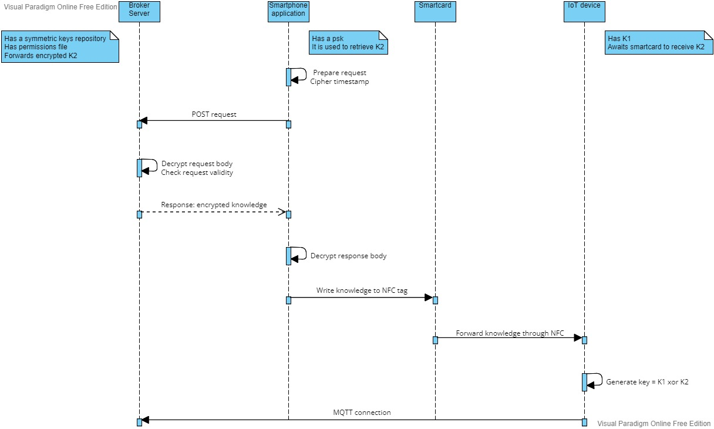

# Separation of knowledge for IoT devices
MQTT is a lightweight protocol that runs over TCP/IP to transport messages in a publish subscribe-paradigm. Since it was developed for IoT devices, it has no security by design at all. The scope of my thesis work at Brain Technologies is to provide a mechanism to secure MQTT. The main problem, regardless any kind of scenario or level of security to provide, is key distribution. The purpose of my proof of concept is to develope a framework to distribute symmetric keys to IoT devices, with the possibility of invalidate them, without involving the devices in complex network configuration.

## Key distribution
The idea is to generate key through separation of knowledge: an algorithm to derive key is divided into two parts, one stored into the IoT device and one into a smartcard (or in a server, and then obtained by using a smartphone through a secure channel). Once the IoT device has received the second part, it is able to generate the final key. In my project, the master key is obtained from a xor operation of a key stored in the IoT device itself and one key obtained from the server. 
Let's consider the case in which a company is in charge to realize key distribution for IoT devices. There are two possibilities: 
1. The company generates an SSL certificate from its CA root and distribute it to its clients. In this way, they are able to connect to company site and obtain the knowledge of selected IoT device in a secure way. Also, a client authentication to the site is needed. It is then necessary to forward the knowledge from the client to the IoT device (using, for example, NFC).
2. The company distributes pre-shared keys to clients to protect client-server connection. Each key is associated to a specific IoT device. Only who has a valid key can obtain the knowledge of the correspondig IoT device. In particular, the client uses an Android application to send an HTTP POST request to the server to receive the knowledge. The path will contain an ID associated to the IoT device, while the body will be a timestamp encrypted with the corresponding psk. The server decrypts the body using the same psk given the ID and, after a check on the timestamp to protect against replay attack, sends back the knowledge encrypted with the same psk. At this point, the client is able to decipher the part of knowledge, write it into an NFC tag to be passed to the IoT device. Now the IoT device has the two parts of knowledge to generate the master key and start MQTT connection. 

### Security assessment
The idea of separation of knowledge helps a lot in guaranteeing the integrity of IoT devices involved. The part of knowledge stored in the server has an expiration date and a validity which can be revoked from server administrator. In this way, in case of expiration, the whole process of key distribution has to be repeted, starting from requesting a new knowledge to the server, providing the IoT device with a new key. In case of corruption or doubt about integrity of IoT device, revoking its validity from the server, it will no longer be able to communicate. Once replaced, the process of key distribution has to be redone for that IoT device. 
Considering now the absolute integrity of IoT device, the main problems regard:
1. Server-smartphone connection: a psk is used to protect communication. To avoid replay attack, the smartphone application send a ciphered timestamp checked from the server, which will respond sending the ciphered knowledge only if the request time is not too old.
2. Smartphone/smartcard-IoT device connection: 
    * It is possible to realize data sniffing also in NFC connection using an "hardware-in-the-middle". An NFC reader could be placed between the IoT device and the smartphone/smartcard. Anyway, the attacker will obtain just a part of knowledge.
    * Through RFID interference, an attacker could realize a DoS attack, preventing correct transmission of data to IoT device. A countermeasure consists in checking radio frequencies by NFC devices during data transmission, so as to stop it. 
3. You need to keep attention where you left your smartphone/smartcard which can be stolen. Another problem regards the use of the smartphone itself: a malicious software (MITB) could be able to intercept the data acquired from the server. In any case, the attacker will obtain just a part of knowledge.

### Usage scenario
This solution is useful in case we want a prephase of configuration of IoT devices, providing them a symmetric key to protect communication. It is suggested to be used in environment in which there is a limited number of IoT devices easily reachable. Examples could be: security system with cameras; freight transport system to automate traffic signals and to track and locate vehicles; electric power generation, transmission and distribution system with sensors and supervisors; fire/gas system with detectors, extinguisher and evacuators; smart weathering system with sensors like wind speed sensor, solar radiation sensor, temperature sensor, etc.. More in general, any kind of SCADA or messaging system with data to protect.

The cycle of operations described is meant to be executed before connecting to MQTT broker in order to provide symmetric key to IoT device with the possibility of disable it. However, it can work as well for other IoT communication protocols like CoAP, XMPP or AMQP. The only aspect to consider is how to encrypt data at source client and decrypt at target client.

## Folders organization
The repository is divided in the following folders:
* simple_example: a Python simulation (in localhost) of key distribution with two different possibilities:
    1. Socket is used to simulate NFC connection between the IoT device and a smartcard from wich the device receives a part of knowledge. At this point, it is able to generate the final key;
    2. Socket is used to simulate a smartphone connecting to a server connection protected by a pre-shared key. The smartphone receives a part of knowledge, forwarded to the IoT device through NFC (simulated again using socket). Now the device is able to generate the final key.
* nginx_server: the actual implementation of the server, realized in cloud through a droplet in DigitalOcean and configured using nginx. There are two possibilities: 
    1. ssl_configuration: as described before, client-server connection is protected using SSL. There is also a client authentication with username and password. It is then necessary to forward the knowledge from the client to the IoT device through NFC.
    2. application: actual server part to handle client request coming from the smartphone application. Communication is ciphered using pre-shared key associated to a specific IoT device. It is possible for the server administrator to revoke a given key and make useless the request of an invalid client.
* smartphoneapp: it contains the actual application code, used to send the POST request to the server. It is necessary to have at least one of the associated pre-shared keys to obtain the knowledge of the corresponding IoT device. Once obtained from the server, it is decrypted and written as NDEF message into a smartcard. 
* IoT_device: it contains the actual script executed by the IoT device. It has a part of knowledge already installed, wait for a smartcard from which it obtains the other part. Eventually, it is able to generate the final key.
